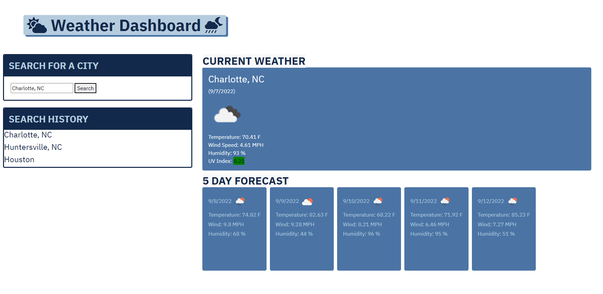

# weather-dashboard
=======
# Edward Beard

## Purpose
The purpose of this site to be able to display a 5-Day Forecast. This application leverages the [OpenWeather API](https://openweathermap.org/api) to pull the weather and Forecast data.  

## Built With
* HTML
* CSS
* Javascript
* jQuery
* Bootstrap
* Server Side APIs

## Features
This webisite was developed with the following features:

* In the Search Box, Enter the Name of a City or City & State (Ex. Charlotte OR Charlotte, NC). You will then be presented with at 5 day Forecast that includes the following:
    * City name
    * Date
    * An icon representation of weather conditions
    * Temperature
    * Humidity
    * Wind speed
    * UV index

* The UV Index is displayed with a color indicating the severity
    * 🟩 0-2 Low
    * 🟨 3-5 Moderate
    * 🟧 6-7 High
    * 🟥 8-10 Very High
    * 🟪 11+ Extreme

* The search history is displayed in a box under the search bar. When clicked, it will bring you to the current weather conditions of the city.

* When the Weather Dashboard is opened, the last searched city Forcast is presented. 

## Website
https://erbeard.github.io/weather-dashboard/

## Contribution
Made with ❤️ by Edward Beard